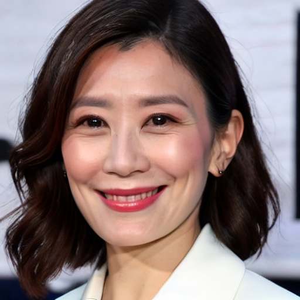
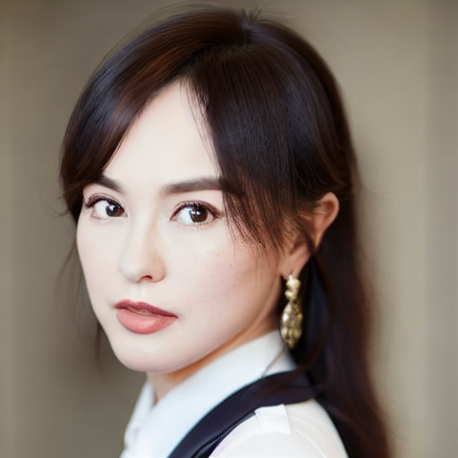
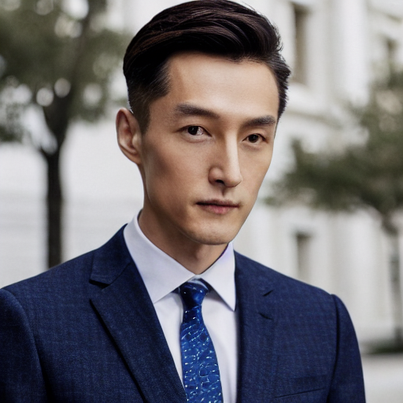
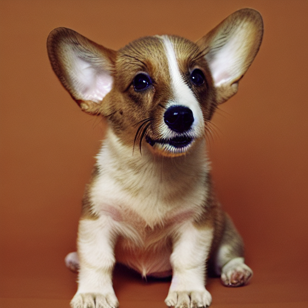
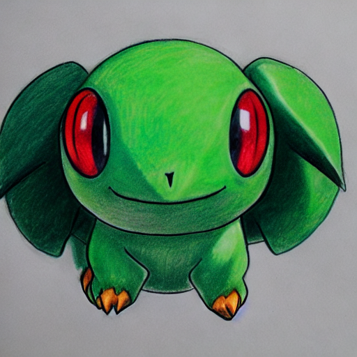

## Avatar Diffusion: 
### Utilizing dreambooth and LoRA to trian or fine-tune  
- **Dreambooth**: 
    Firstly, I selected 8 photos of the renowned football star Cristiano Ronaldo (my favourite football star) playing on the field as the training set. By loading the software-defined and using the modified code of diffusers, I selected <i>[these](./res/Dreambooth/train_config.txt)</i> training parameters: ` --instance_prompt="a photo of cr7d man" \
    --class_prompt="a photo of man" \
    --resolution=512 \
    --train_batch_size=1 \
    --gradient_accumulation_steps=1 \
    --learning_rate=2e-6 \
    --lr_scheduler="constant" \
    --lr_warmup_steps=0 \
    --max_train_steps=350 \
    --report_to="wandb" ` and simply fine-tuned the weights of Unet. When prompted with <i>"cr7d man, wearing a neat suit, facing the camera, smiling, high quality"</i>, I chose two images with high fidelity and delicate mesh. They are presented below:

    

        
        
    

    In this case, the training process takes approximately 5 minutes on four 3090 graphics cards, each with 24 GiB of VRAM.

    

        
    

    In another training session, I selected 12 pictures of a female celebrity. Can you guess who she is?

    

        
    

    During the training process, I observed that the optimal number of images in the training set ranges from approximately 5 to 10, particularly when training the avatar generation model. Additionally, the appropriate learning rate (lr-rate) is around 2e-6. A good value for --max_train_steps should be equal to the number of images in the training set multiplied by a factor between 50 and 100. This ensures that each image is learned 50 to 100 times. If --max_train_steps is set smaller than this range, we may find that the avatars generated are not as familiar with the training set, as the epoch for each image is too short and the learning process is not sufficiently thorough. Conversely, if a value larger than the range is chosen, we may encounter overfitting during training, resulting in noise on the avatar's face after denoising by Unet.
    
    

        
        
        
        
    

    More images generated by the fine-tuned models are shown above.
- **LoRA**: 
    I used the [pokemon]() dataset in huggingface and utilized the initial code named `train_text_to_image_lora.py` and the default parameters of training. The results can be found [here](./res/T2I-LoRA/).

    

        
    

### Multi-View Clip
Coming soon...