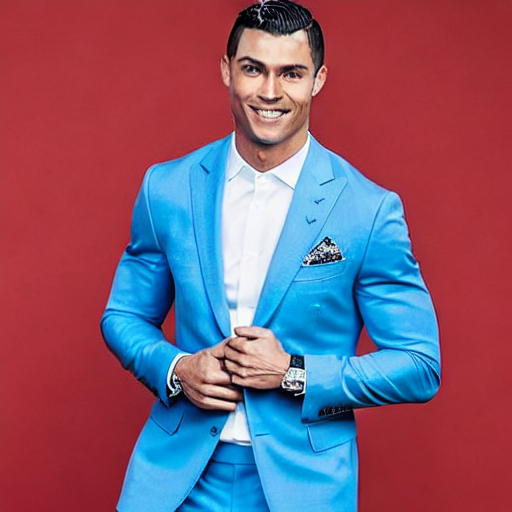

## Avatar Diffusion: 
### Utilizing dreambooth and LoRA to trian or fine-tune  
- **Dreambooth**: 
    For this task, I selected 8 photos of the renowned football star Cristiano Ronaldo (my favourite ft star haha) playing on the field as the training set. By loading the software-defined and using the modified code of diffusers, I selected <i>[these](./res/Dreambooth/train_config.txt)</i> training parameters: ` --instance_prompt="a photo of cr7d man" \
    --class_prompt="a photo of man" \
    --resolution=512 \
    --train_batch_size=1 \
    --gradient_accumulation_steps=1 \
    --learning_rate=2e-6 \
    --lr_scheduler="constant" \
    --lr_warmup_steps=0 \
    --max_train_steps=350 \
    --report_to="wandb" ` and simply fine-tuned the weights of Unet. When prompted with <i>"cr7d man, wearing a neat suit, facing the camera, smiling, high quality"</i>, I chose two images with high fidelity and delicate mesh. They are presented below:

    

        
        
    

    In this case, the training process takes approximately 5 minutes on four 3090 graphics cards, each with 24 GiB of VRAM.

    

        
    

    In another training session, I selected 12 pictures of a female celebrity. Can you guess who she is?

    

        
    

- **LoRA**: 
    I used the [pokemon]() dataset in huggingface and utilized the initial code named `train_text_to_image_lora.py` and the default parameters of training. The results can be found [here](./res/T2I-LoRA/).

### Multi-View Clip
Coming soon...